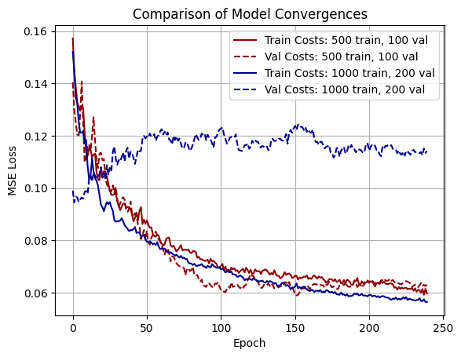
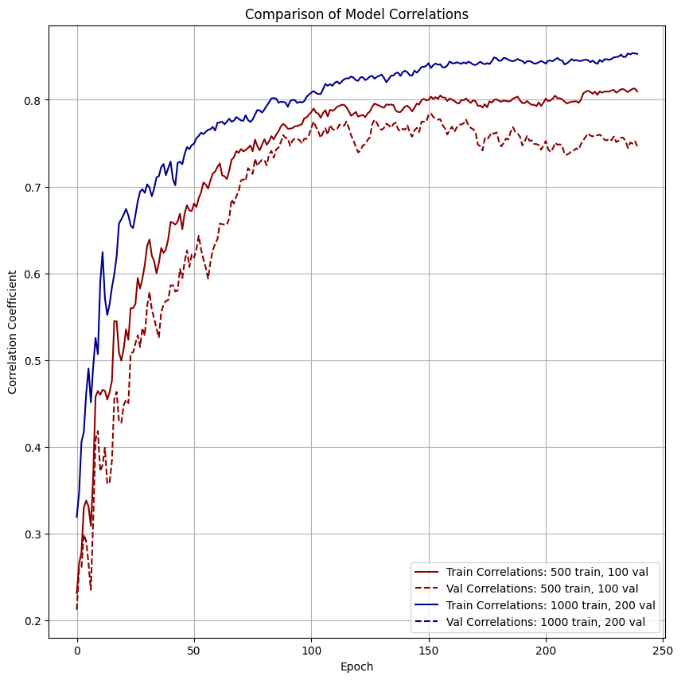

# Day 19: 18th May 2025
## Entry 1: 09:30
Today I will be working in between revision, so I won't be able to fully focus on what I need to do. What I want to do is see if increasing the amount of train data has a noticeable effect on convergence. This need to be done before the other experiments - I don't want to spend a long time optimising parameters for 500 train pairs when a greater number of train pairs works much better.

On a positive note, I'm not sure what I was talking about in the last entry RE the correlation coefficient - the correlation is actually very good! After training it goes from near zero (as expected for randomly-initialised rotation gates) to 0.7-0.8, showing a strong positive correlation! This is very promising.

## Entry 2: 11:23
After a small amount of testing I don't think the amount of train data is making much difference. I tried similarity labels with 1000 train pairs and 200 validation pairs (both double what I was using before) and it doesn't seem to have made much meaningful difference. I'm running a more rigorous experiment just in case (learning rate 1, 120 epochs, avg. over 5 training runs), but I think I can disregard trying to increase the length of my training data. Which is good, because I'd need more RAM if I had more data.

While those experiments are running, this repo has gotten bloated again. What I really need to do is the following:
1. Clean up the 'numpy-model' branch and structure it like an actual module.
2. Move all experimental data into its own 'experiments' branch.
3. Merge 'numpy-model' into main.
4. Add a toml to make my package importable, making every script much neater.
5. Add various READMEs to make understanding my model + the module much easier.

## Entry 3: 22:24
I have totally reworked the github repo, with the new structure making much more sense. The main branch houses my fidelity model and other utility functions, as well as the altered lambeq trainer (to track correlation coefficient), in a new installable python package called `fidelity_model`. I have a neq 'experiments' branch which houses the Devlog and experimental data.

On that note, I have run the experiment where I double the amount of training and validation data. The results are shown below.

| | | 
|:-------------------------:|:-------------------------:|
|  Model Convergences (MSE Loss vs. Epoch) |   Model Correlations (Pearson Correlation Coefficient Between Labels + Predictions vs. Epoch)

Clearly, the 500 train, 100 val dataset performs better, as the model convergences show heavy overfitting. This is likely because the dataset only consists of 17 words and 130 sentences. On the plus side, this means I don't need to have a bigger dataset, which means lower training times.

Tomorrow I will do a quick write-up of this experiment as a markdown README, and I will also update the other READMEs in the repo. Then I'll move onto the next investigation: ansatz.