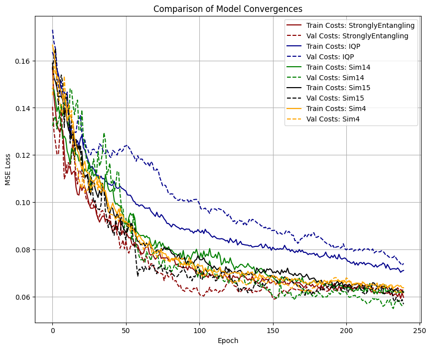
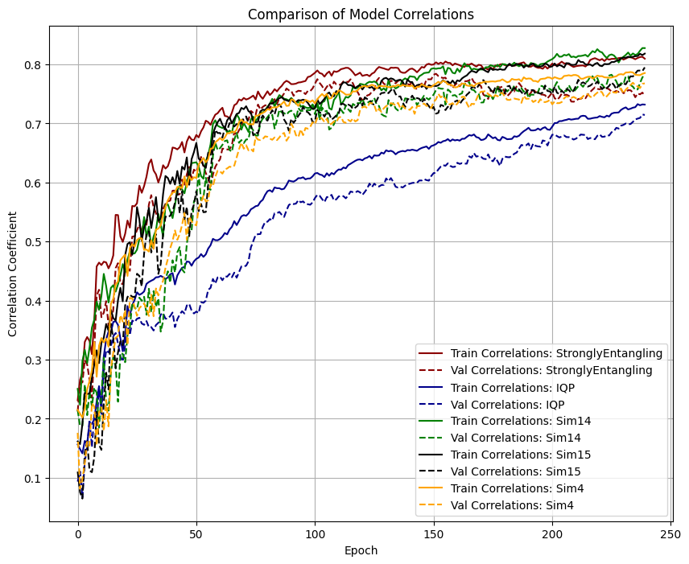
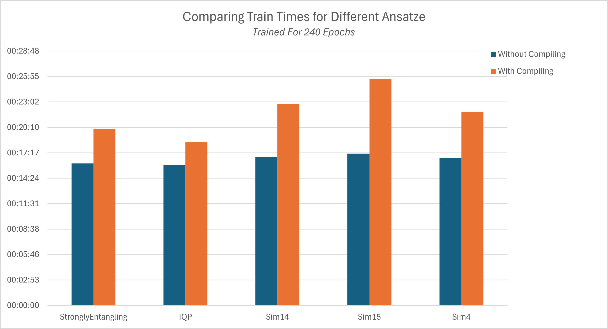

# Day 20: 19th May 2025
## Entry 1: 14:09
After some revision this morning, I can get back to the project. After changing the github repo layout, I'm ready to get cracking with the rest of the investigations which need to happen. First I'll investigate the effect of ansatz on training, making a record of:
- Circuit generation time
- Training time across 240 epochs
- Convergence
- Pearson correlation

This data will allow me to select the best ansatz to use out of IQP, Strongly Entangling, Sim14, Sim15 and Sim4. I know that the latest lambeq update also introduced two more ansatze; I'm too scared to update lambeq at the moment in case it breaks everything, but I might give it a go if I have time.

## Entry 2: 20:39
Interesting results. From the graphs below, we can see that basically all of the ansatze perform the same. A notable exception is the IQP ansatz, which performs worse than all the others.

| | | 
|:-------------------------:|:-------------------------:|
|  Model Convergences (MSE Loss vs. Epoch) |   Model Correlations (Pearson Correlation Coefficient Between Labels + Predictions vs. Epoch)

StronglyEntangling might have *just about* the best performance, but it's very close between the other ansatze. To help decide, I also recorded the training times of each ansatze, and also the times taken to generate the train and val circuits. The results are shown below.

As is clear, the times disregarding the JIT compilation time is about the same for all ansatze. However, the JIT compilation times cannot be ignored, as I have tried and failed to save pre-compilation through caching. Therefore the important times are those which *do* include this compilation time. The IQP ansatz takes the least amount of time to train, but it is the worst performing by a significant margin. Therefore the best ansatz to use is the StronglyEntangling ansatz, which has the second-lowest training times and among the best performance. It is therefore this ansatz which I will use for the remainder of this project (unless I get round to trying the 2 new ones and one of them is markedly better).