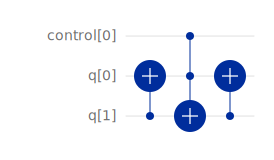

# Day 12: 28th November 2024
## Entry 1: 08:56
Yesterday I spent the day training my model with various different hyperparameters to get a feel for how well the model is converging. Each run of 120 epochs takes about half an hour. This is obviously far slower than I would like.

Therefore today I will put in an entire day's work to try and build my fidelity model onto lambeq's NumpyModel, rather than its QuantumModel. Since the NumpyModel uses JIT-compiled code, it should be much faster, potentially as much as an order of magnitude. Unfortunately, unlike the Aer simulator it is not shot-based, and so I will have to find another way of performing post-selection. I'm hoping my work on the `noiseless_simulation` branch will help with this.

## Entry 2: 14:04
Finally, my curse is at an end and I am making progress again! Fantastic progress as it turns out.

I have managed to successfully tweak lambeq's NumpyModel. Now my model uses NumPy to efficiently post-select and execute the circuits to retrieve the state probabilities. It even works with JIT-compilation! This means that, whereas yesterday it was taking around an hour to train for 240 epochs, ***it now only takes about 45 seconds***. This is a remarkable speedup which will hugely accelerate the rate at which I work.

After trying various approaches, the way I adapted the NumPy model was to minimally change the model class itself; I instead change the `fidelity_pqc_gen` function to add a swap test to the circuit. This was done using lambeq's diagrams, which are built on DisCoPy's diagrams. The issue I had is that there is no CSWAP gate in lambeq diagrams; to implement I had to read [a paper](https://journals.aps.org/pra/abstract/10.1103/PhysRevA.53.2855) which showed that a CSWAP can be made from two CNOTs and a Toffoli as follows:

I was able to implement this easily. The only alteration to the model class itself was to return the fidelities rather than the probability matrices.