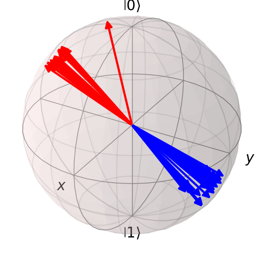
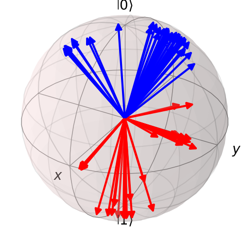

# Binary Classification with Classical KNN
## Table of Contents
- [Motivation](#motivation)
- [Experimental Procedure](#experimental-procedure)
- [Expectations](#expectations)
- [Results and Analysis](#results-and-analysis)
  - [Model Convergences](#model-convergence)
  - [Generated States](#generated-states)

## Motivation

The purpose of this experiment was to see whether my fidelity-based
language model would be effective for binary classification of sentences
using a classical KNN algorithm. This is one of the most-studied
problems in NLP and QNLP, and so if my model is remotely useful it
should also be able to complete this simple task with some degree of
accuracy.

It is also an interesting test of how widely-applicable my language
model is. While in theory it is suited best to recommendation systems,
if it is also good for text classification it will only broaden the
utility of the model.

## Experimental Procedure

A well-used dataset is from the lambeq documantation[^@Lorenz_2023], and
consists of 130 sentence which are either about food or about IT. These
sentences were generated using simple context-free grammar, and the
vocabulary size is very small (only seventeen distinct words). As a
result, it is a simeple 'best-case' initial test of a binary classifier.

I split these sentences into 100 'train' sentences and 30 'test'
sentences. The training dataset consisted of 500 pairs of the test
sentences, each with a label, and the validation dataset consisted of
100 different pairs of the same test sentences, each with a label. Two
types of label were used:

- Binary labels: 0 if the two sentences in the pair were of different
  classes, and 1 if the two sentences were of the same class.

- Similarity labels: the label was the dot-product similarity between
  the sentences as calculated by a classical SBERT language model (model
  all-MiniLM-L6-v2)[^@SBERT].

Thus I had two datasets; the dataset with binary labels is hearafter
referred to as the *binary labels* dataset, and the dataset with
similarity labels is hereafter referred to as the *similarity labels*
dataset.

My model was trained on both of these datasets using three different
language models: DisCoCat, bag-of-words and word-sequence. After
training, each trained model was used to classify the 30 unseen 'test'
sentences. Classification was achieved with a classical KNN algorithm
(with K arbitrarily K set to 5 for this brief experiment), and the
classification accuracy was calculated. As an aside, the state vectors
of the train and test sentences produced by the model were collected and
plotted on a Bloch sphere. This aided in visualising how well the model
performed; in an ideal case, the states should form two separated
clusters on the Bloch sphere, with one of these clusters containing the
'food' sentence states and one containing the 'IT' sentence states.

A similar procedure was conducted with a lambeq NumPy model; the train
sentences were split into 70 train and 30 validation sentences, and the
model was trained using these sentences and binary labels. The unseen
test sentences were then passed through the model, and the output of the
model was taken as the labels to apply to the test sentences (in this
case, an output of 0 corresponded to IT, and an output of 1 corresponded
to food). Again, the state vectors of the train and test sentences
produced by the model were collected and plotted on a Bloch sphere. This
was repeated for each of the three language models.

## Expectations

I expected that the lambeq model would perform better than my fidelity
model. This is because the lambeq model has been specifically designed
for classification (particularly binary classification), and has had
years of development by experts in the field, whereas my model is more
general and has only been developed over the course of a few months.

I also expect that my model will achieve better results with binary
labels than with the similarity labels. This is because in natural
language, these sentences have nonzero similarity, as they all follow
the same basic grammar pattern and basic template of 'someone doing
something'. Take the two sentences *woman debugs program* and *man
prepares dinner*. In the context of natural language, these sentences
are quite similar, as they both follow the same grammatical pattern and
both concern a human being doing something to an object. In the context
of this experiment, however, the two sentences have no similarity, as
all we care about in this experiment is whether the sentences are about
food or IT.

For similar reasons, I expect the DisCoCat model to perform worse than
the other two language models, as this model takes into account the
grammar of the sentence, which for this experiment is (arguably)
irrelevant.

## Results and Analysis

### Model Convergence
| | | |
|:-------------------------:|:-------------------------:|:-------------------------:|
| 1a) Using the Bag of Words language model. |   1b) Using the DisCoCat language model.|  1c) Using the Word Sequence language model. | 

> ***Figure 1**: Graphs showing the convergences of the models during training.*

Figure 1 shows that in all cases, my fidelity model converged faster than the
lambeq model. It is clear that my model trained with binary labels
converged to a lower cost than my model trained with similarity labels,
indicating it should perform better in binary classification, as
expected.

### Generated States

#### Bag of Words

| | | |
|:-------------------------:|:-------------------------:|:-------------------------:|
| 2a) Train states: fidelity model, binary labels |  2b) Train states: fidelity model, similarity labels. | 2c) Train states: lambeq model. |
| 2d) Test states: fidelity model, binary labels |  2e) Test states: fidelity model, similarity labels. | 2f) Test states: lambeq model. |

> ***Figure 2**: Bloch spheres showing the sentence states generated when using the Bag of Words language model. The red states are those associated with sentences about food, and the blue states are those associated with sentences about IT. Figs. a-c show the states of the train sentences, and Figs. d-f show the states of the test sentences.*

Fig. 2 clearly shows that in every case the models are trained such that the
sentence states 'cluster' to form two distinct groups on the Bloch
sphere: one for states representing sentences about food, and one for
states representing sentences about IT. Also in all cases, the test
states follow approximately the same clustering as the train states,
showing that all models handle new input well.

As can be seen by Figs. 2a and 2d, the state clustering is greatest for
my fidelity model trained with binary labels, suggesting that this model
will have the best binary classification performance out of the three
models.

As can be seen by 2b and 2e, the state clustering is by far
the weakest for my fidelity model trained with similarity labels. While
the states are separated into two groups, the groups are very spread
out, and there is a small gap between their boundaries. This spreading
is likely to result in poor binary classification performance.

#### DisCoCat
| | | |
|:-------------------------:|:-------------------------:|:-------------------------:|
| 3a) Train states: fidelity model, binary labels |  3b) Train states: fidelity model, similarity labels. | 3c) Train states: lambeq model. |
| 3d) Test states: fidelity model, binary labels |  3e) Test states: fidelity model, similarity labels. | 3f) Test states: lambeq model. |

> ***Figure 3**: Bloch spheres showing the sentence states generated when using the DisCoCat language model. The red states are those associated with sentences about food, and the blue states are those associated with sentences about IT. Figs. a-c show the states of the train sentences, and Figs. d-f show the states of the test sentences.*

Similar to the previous section, Fig. 3 shows the same clustering of states on the Bloch sphere, however in this case the groups are generally more spread out. This is an interesting comparison between the Bag of Words and DisCoCat language models in the context of binary classification; for whatever reason, DisCoCat results in worse separation of sentence states based on binary labels.

As in the previous section, Figs. 3a and 3d show that the state clustering
is greatest for my fidelity model trained with binary labels, suggesting
that again this model will have the best binary classification
performance out of the three models.

As can be seen by 3b and 3e the state clustering is still the weakest for my fidelity model trained with similarity labels. However, Figs 3c and 3f show that some of the IT sentence states cluster in the group of food sentence states, meaning these sentences will most likely be incorrectly classified. Therefore, it is possible that when using DisCoCat, the lambeq model will actually have worse performance than my fidelity model.

#### Word Sequence
| | | |
|:-------------------------:|:-------------------------:|:-------------------------:|
| 4a) Train states: fidelity model, binary labels |  4b) Train states: fidelity model, similarity labels. | 4c) Train states: lambeq model. |
| 4d) Test states: fidelity model, binary labels |  4e) Test states: fidelity model, similarity labels. | 4f) Test states: lambeq model. |

> ***Figure 4**: Bloch spheres showing the sentence states generated when using the Word Sequence language model. The red states are those associated with  entences about food, and the blue states are those associated with sentences  bout IT. Figs. a-c show the states of the train sentences, and Figs. d-f show the states of the test sentences.*

Again, Fig. 4 shows the same clustering of states on the Bloch sphere. In this case the the states are again more spread out than for the Bag of Words language model, but while my model's performance is similar in this case
than in the DisCoCat case, the lambeq model produces states which are
noticably more spread out than in the previous two cases. This suggests
that Word Sequence gives the worst binary classification performance for
the lambeq model.

As in the previous section, Figs. 4a and 4d show that the state clustering is
greatest for my fidelity model trained with binary labels, suggesting
that again this model will have the best binary classification
performance out of the three models. Interesitngly, in this case the
states are not clustered around the computational basis states as
before, but a pair of orthogonal states at some significant angle to the
computational basis. Because my model will classify based on fidelity
between states, not by measuring the states themselves, this shouldn't
impact binary classification performance in any way.

As can be seen by 4b, 4e, 4c and 4f, the state clustering is approximately
the same for my fidelity model trained on similarity labels and lambeq's
model; some of the states are in the wrong cluster, suggesting that
these models will not have good binary classification performance.

### Binary Classification Performance

| |Fidelity Model (binary labels)| Fidelity Model (similarity labels)|     Lambeq |
|:---------------:|:-----------------:|:---------------------:|---------:|
| DisCoCat | 100.00% | 100.00% | 96.55% |
| Bag of Words | 100.00% | 100.00% | 100.00% |
| Word Sequence | 100.00% | 96.55% | 89.66% |

>***Table 1**: Accuracies of binary classification of 30 unseen test sentences.*

Table 1 shows that my
fidelity model was able to classify the test sentences better to the
same level or better than lambeq's model in every instance, regardless
of the language model or type of labels used. Using binary labels, my
model classified the test sentences perfectly with every language model
tested. This is incredibly promising, and suggests that my model could
be good for sentence classification despite not necessarily being
designed with it in mind.

[^@Lorenz_2023]: Robin Lorenz, Anna Pearson, Konstantinos Meichanetzidis, Dimitri Kartsaklis, and Bob Coecke.
Qnlp in practice: Running compositional models of meaning on a quantum computer. *Journal of
Artificial Intelligence Research*, 76:1305–1342, April 2023.

[^@SBERT]:  Sbert pretrained models. <https://www.sbert.net/docs/sentence_transformer/pretrained_models.html>. Accessed: 01/03/2025.

